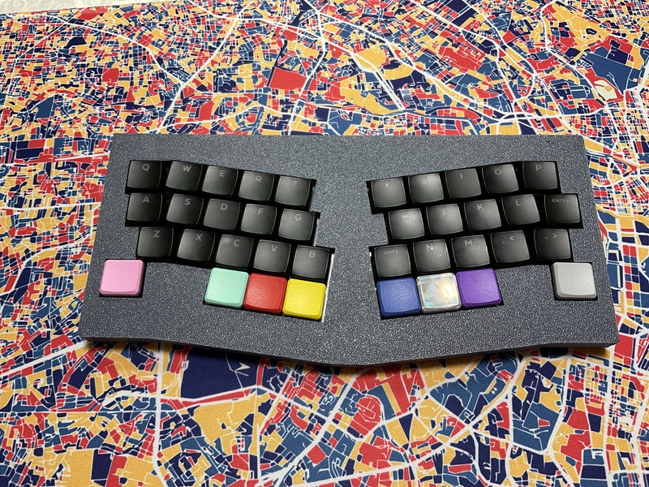
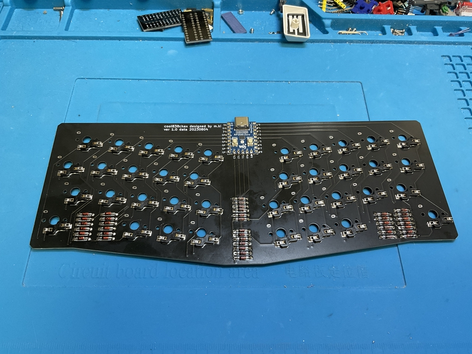
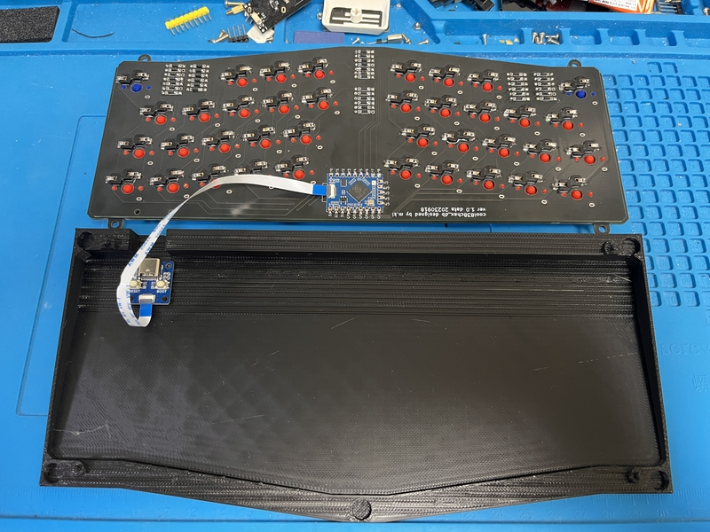

# cool838chax

cool838chax is a small keyboard. 
 
This keyboard has 38 keys. 
 
cool838chax is an Alice layout. 
 
cool838chax use RP2040-Zero,run QMK_firmware.
 
cool838chax is cool838ax with choc switch and narrow key layout.
 

And,this is cool838chax-db using RP2040-Tiny.
 

## Firmware

The same thing as cool838ax and cool838chax-db can be used.
 
[Here](https://github.com/telzo2000/cool838ax/tree/main/firmware)

 

cool838chax and cool838chax-db are the same in design as [cool838ax](https://github.com/telzo2000/cool838ax). The difference is the key switch.
 

cool838chaxとcool838chax-dbは、[cool838ax](https://github.com/telzo2000/cool838ax)と設計上、同じものです。違いはキースイッチです。
 

## Buildguide

https://github.com/telzo2000/cool838chax/blob/main/buildguide_for_cool838chax.md

## Parts list

### For cool838chax
| No. | Patrs | Quantity | remarks | Suppliers | Cost |
|--|--|--|--|--|--|
|番号|名前|数|備考|調達先|参考価格（送料込）| 
|1|PCB|1|38key AlicLayout|[elecrow](https://www.elecrow.com) [JLCPCB](https://jlcpcb.com) [ALLPCB](https://www.allpcb.com)|５枚で20〜30ドル| 
|2|Switch Plate|1||[elecrow](https://www.elecrow.com) [JLCPCB](https://jlcpcb.com) [ALLPCB](https://www.allpcb.com)|５枚で20〜30ドル| 
|3|RP2040-Zero|1||[Talp Keyboard](https://talpkeyboard.net)|800円|
|4|Swith socket スイッチソケット|38|shoc|[遊舎工房](https://yushakobo.jp) [Talp Keyboard](https://talpkeyboard.net) [Daily Craft Keyboard](https://shop.dailycraft.jp)等|10個で165円程度|
|5|Diode ダイオード|38|SMDを推奨|[遊舎工房](https://yushakobo.jp) [Talp Keyboard](https://talpkeyboard.net) [Daily Craft Keyboard](https://shop.dailycraft.jp)等|100個で220円程度から|
|6|TopCase|1|3D Print|||
|7|BottomCase|1|3D Print||

### For cool838chax-db
| No. | Patrs | Quantity | remarks | Suppliers | Cost |
|--|--|--|--|--|--|
|番号|名前|数|備考|調達先|参考価格（送料込）| 
|1|PCB|1|38key AlicLayout|[elecrow](https://www.elecrow.com) [JLCPCB](https://jlcpcb.com) [ALLPCB](https://www.allpcb.com)|５枚で20〜30ドル| 
|2|Switch Plate|1||[elecrow](https://www.elecrow.com) [JLCPCB](https://jlcpcb.com) [ALLPCB](https://www.allpcb.com)|５枚で20〜30ドル| 
|3|RP2040-Tiny|1||[スイッチサイエンス](https://www.switch-science.com/products/9092)|891円|
|4|Swith socket スイッチソケット|38|shoc|[遊舎工房](https://yushakobo.jp) [Talp Keyboard](https://talpkeyboard.net) [Daily Craft Keyboard](https://shop.dailycraft.jp)等|10個で165円程度|
|5|Diode ダイオード|38|SMDを推奨|[遊舎工房](https://yushakobo.jp) [Talp Keyboard](https://talpkeyboard.net) [Daily Craft Keyboard](https://shop.dailycraft.jp)等|100個で220円程度から|
|6|TopCase|1|3D Print|||
|7|BottomCase|1|3D Print||

In addition, you will need a USB cable, keycaps, etc.
 
この他に、USBケーブル、キーキャップ等が必要です。
 