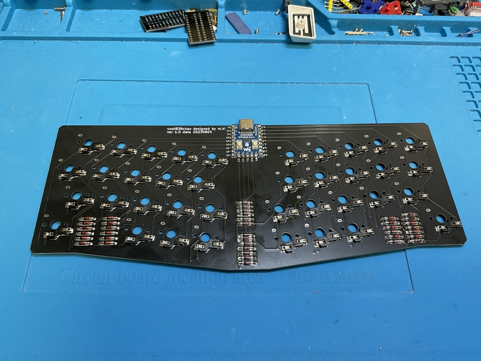
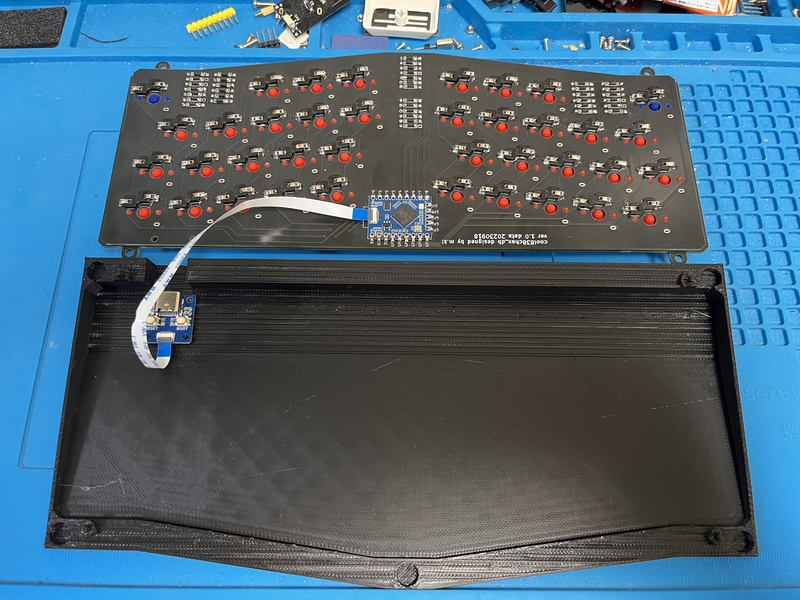

## Build guide

## Firmware

###  QMK_FIRMWARE

[Here](https://github.com/telzo2000/cool838ax/tree/main/firmware)

 

[remap](https://remap-keys.app/catalog/pLXvG6i1dYtpbWD7ujzv)

 

## Build 1

### 1 Diode soldering

Solder the diodes to the back of PCB.
 
PCBの裏面にダイオードのハンダ付けをします。
 
There are lead type and SMD diodes.
 
ダイオードはリードタイプか、SMDがあります。

 
cool838chax uses choc switches, so the distance between the switch plate and the PCB is narrow.
 
cool838chaxは、chocスイッチを使用しているため、スイッチプレートとPCBとの間隔が狭いです。
 
It is recommended to use SMD rather than lead type.
 
リードタイプを使用するよりも、SMDを使用することを推奨します。
 
If you use a lead type, cut the protruding legs short.
 
もし、リードタイプを使用する場合、はみ出た足を短く切り取ってください。
 

[８倍速　Diodeハンダ付け動画](https://youtu.be/Yaodh2-XxV4)

 
 

### 2 Soldering switch sockets

Solder the switch sockets on the back side.
 
裏面にスイッチソケットのハンダ付けをします。
 

[８倍速　Switch socketハンダ付け動画](https://youtu.be/E__mHvmIXQo)

  

### 3a　Soldering RP2040-Zero (cool838chax) 

The side on which the RP2040-Zero components are mounted is the front side, and the opposite side is the back side.
 
RP2040-Zeroの部品実装されている面を表面とし、反対側を裏面とします。
 
Place the back side of the PCB and the back side of the RP2040-Zero facing each other and solder the respective terminals.
 
PCBの裏面とRP2040-Zeroの裏面が向かい合うようにして置き、それぞれの端子をハンダ付けします。
 

 

### 3b Soldering RP2040-Tiny (cool838chax-db)

The side on which the RP2040-Tiny components are mounted is the front side, and the opposite side is the back side.
 
RP2040-Tinyの部品実装されている面を表面とし、反対側を裏面とします。
 
Place the back side of the PCB and the back side of the RP2040-Tiny facing each other and solder the respective terminals.
 
PCBの裏面とRP2040-Tinyの裏面が向かい合うようにして置き、それぞれの端子をハンダ付けします。
 
At this point, we will not attach it to the adapter board yet.
 
ここでは、まだアダプタ基板との取り付けはしません。
 

### 4 Instorlling QMK＿Firmware

Install QMK_Firmware from your PC to RP2040-Zero.
 
QMK_FirmwareをPCからRP2040-Zeroにインストールしてください。
 
 
① Download https://github.com/telzo2000/cool838ax/blob/main/firmware/cool838ax_via.uf2　to your PC.
 
①https://github.com/telzo2000/cool838ax/blob/main/firmware/cool838ax_via.uf2　をPCにダウンロードしておく。

  
② Connect the PC and RP2040-Zero with a USB cable.
 
②PCとRP2040-ZeroをUSBケーブルで繋ぐ。
  
③Press the reset button while pressing the boost button on the RP2040-Zero.
 
③RP2040-Zeroのboostボタン押しながら、resetボタンを押す。
  
④Since there is a folder of RP2040-Zero on the PC screen, drag and drop the downloaded cool838ax.uf2 there.
 
④PC画面にはRP2040-Zeroのフォルダがあるので、そこに、ダウンロードしたcool838ax.uf2をドラッグアンドドロップする。
  

⑤Check if it is recognized by connecting to remap. Edit the keymap accordingly.
 
⑤remapに繋いで認識するかどうか確認する。合わせてキーマップの編集をする。

### Build 2(case)

### 1 Case (cool838chax)

I will explain using a case printed by stereolithography of black resin ordered from JLCPCB. The procedure is basically the same for cases printed with Ankemake M5 for home use.
 
JLCPCBに発注したブラックレジンの光造形で印刷されたケースを使って説明します。家庭用AnkemakeM5で印刷したケースでも作業の手順は、基本的に同じです。
 
 
Fix the magnets to the five dents inside the case with an adhesive or the like. There are ５ in the top case and ５ in the bottom case for a total of １０.Please pay attention to the polarity of the magnet. Make sure the top case and bottom case are magnetically attached.
 
ケースの内側にある５つの凹みに磁石を接着剤などで固定します。トップケースに５箇所、ボトムケースに５箇所の合計１０箇所です。
極性に注意してください。トップケースとボトムケースが磁力で着くようにしてください。
 

As shown in the image below, attach rubber O-rings to the four protrusions on the bottom case. This makes it a gasket mount. You can do without the O-ring, but the PCB may move up and down inside the case.
 
下の画像のように、ボトムケースに4箇所の凸部にゴムのO-ringを装着します。これによりガスケットマウントとなります。O-ringはなくても大丈夫ですが、ケース内で、PCBが上下に動く可能性があります。
 

The O-ring is [this product](https://www.amazon.co.jp/gp/product/B07G4SM5SM/ref=ppx_yo_dt_b_asin_title_o03_s00?ie=UTF8&psc=1).
 
O-ringは[この商品](https://www.amazon.co.jp/gp/product/B07G4SM5SM/ref=ppx_yo_dt_b_asin_title_o03_s00?ie=UTF8&psc=1)です。
 
 
Place the hole in the switch plate on the O-ring. And it is completed by covering the top case.
 
スイッチプレートの穴をO-ringに載せます。そして、トップケースを被せて完成です。
 

### 1 Case (cool838chax-db)

I will explain using a case printed by stereolithography of black resin ordered from JLCPCB. The procedure is basically the same for cases printed with Ankemake M5 for home use.
 
JLCPCBに発注したブラックレジンの光造形で印刷されたケースを使って説明します。家庭用AnkemakeM5で印刷したケースでも作業の手順は、基本的に同じです。
 
 
Fix the magnets to the five dents inside the case with an adhesive or the like. There are ５ in the top case and ５ in the bottom case for a total of １０.Please pay attention to the polarity of the magnet. Make sure the top case and bottom case are magnetically attached.
 
ケースの内側にある５つの凹みに磁石を接着剤などで固定します。トップケースに５箇所、ボトムケースに５箇所の合計１０箇所です。
極性に注意してください。トップケースとボトムケースが磁力で着くようにしてください。
 
Attach the RP2040-Tiny adapter board to the bottom case. Make sure that the four holes on the adapter board match the four protrusions on the bottom base.
 
ボトムケースにRP2040-Tinyのアダプタ基板を取り付けます。アダプタ基板の４つの穴とボトムのースの４つの突起が組み合わさるようにしてください。
 
The protrusions are very thin and break easily. If you are worried, please fix the adapter board and bottom case with double-sided tape.
 
突起はとても、細く、折れやすいです。心配ならば、アダプタ基板とボトムケースを両面テープで、固定してください。
 
Next, connect the adapter board and RP2040-Tiny with the FPC cable. Be careful of the cable orientation.
 
次に、アダプタ基板とRP2040-TinyをFPCケーブルで接続してください。ケーブルの向きに注意してください。
 

Now run 4 Installing QMK_Firmware.
 
ここで、4 Instorlling QMK＿Firmwareを実行してください。
 
 
As shown in the image below, attach rubber O-rings to the four protrusions on the bottom case. This makes it a gasket mount. You can do without the O-ring, but the PCB may move up and down inside the case.
 
下の画像のように、ボトムケースに4箇所の凸部にゴムのO-ringを装着します。これによりガスケットマウントとなります。O-ringはなくても大丈夫ですが、ケース内で、PCBが上下に動く可能性があります。
 

The O-ring is [this product](https://www.amazon.co.jp/gp/product/B07G4SM5SM/ref=ppx_yo_dt_b_asin_title_o03_s00?ie=UTF8&psc=1).
 
O-ringは[この商品](https://www.amazon.co.jp/gp/product/B07G4SM5SM/ref=ppx_yo_dt_b_asin_title_o03_s00?ie=UTF8&psc=1)です。
 
 
Place the hole in the switch plate on the O-ring. And it is completed by covering the top case.
 
スイッチプレートの穴をO-ringに載せます。そして、トップケースを被せて完成です。
 

Welcome to the world of 38 keys.
 
38キーの世界へようこそ。
 

